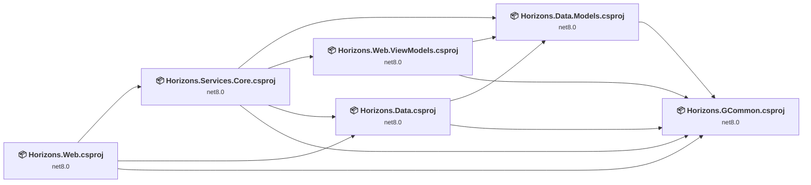
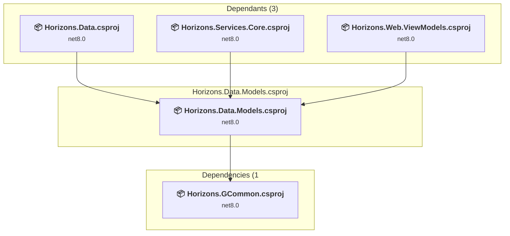
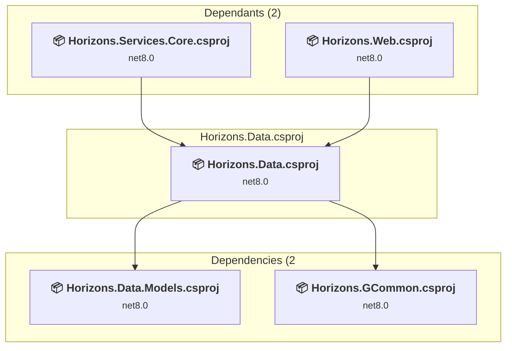
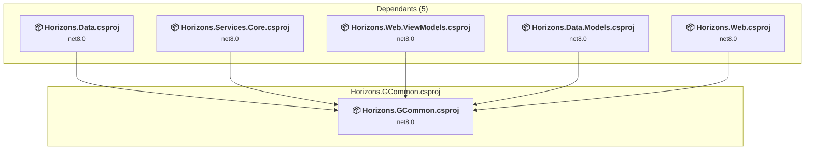
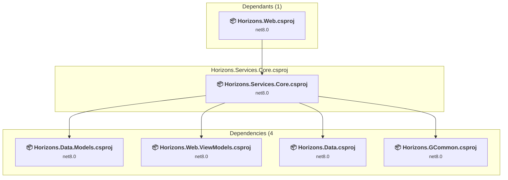
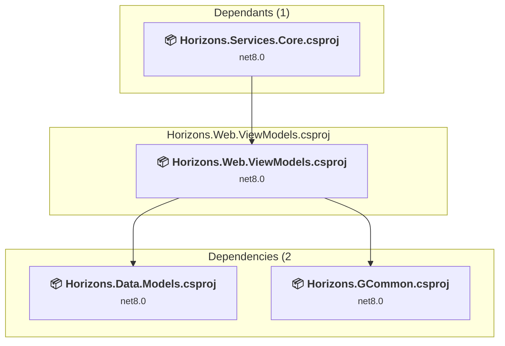
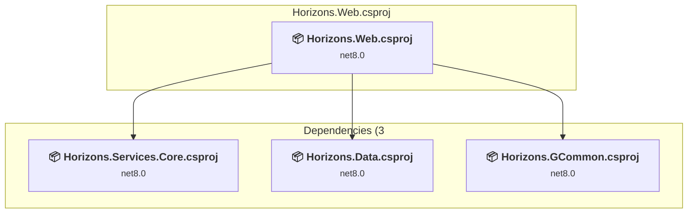

# Projects and dependencies analysis

This document provides a comprehensive overview of the projects and their dependencies in the context of upgrading to .NETCoreApp,Version=v10.0.

## Table of Contents

- [Executive Summary](#executive-Summary)
  - [Highlevel Metrics](#highlevel-metrics)
  - [Projects Compatibility](#projects-compatibility)
  - [Package Compatibility](#package-compatibility)
  - [API Compatibility](#api-compatibility)
- [Aggregate NuGet packages details](#aggregate-nuget-packages-details)
- [Top API Migration Challenges](#top-api-migration-challenges)
  - [Technologies and Features](#technologies-and-features)
  - [Most Frequent API Issues](#most-frequent-api-issues)
- [Projects Relationship Graph](#projects-relationship-graph)
- [Project Details](#project-details)

  - [Horizons.Data.Models\Horizons.Data.Models.csproj](#horizonsdatamodelshorizonsdatamodelscsproj)
  - [Horizons.Data\Horizons.Data.csproj](#horizonsdatahorizonsdatacsproj)
  - [Horizons.GCommon\Horizons.GCommon.csproj](#horizonsgcommonhorizonsgcommoncsproj)
  - [Horizons.Services.Core\Horizons.Services.Core.csproj](#horizonsservicescorehorizonsservicescorecsproj)
  - [Horizons.Web.ViewModels\Horizons.Web.ViewModels.csproj](#horizonswebviewmodelshorizonswebviewmodelscsproj)
  - [Horizons.Web\Horizons.Web.csproj](#horizonswebhorizonswebcsproj)

## Executive Summary

### Highlevel Metrics

| Metric | Count | Status |
| :--- | :---: | :--- |
| Total Projects | 6 | All require upgrade |
| Total NuGet Packages | 7 | All packages need upgrade |
| Total Code Files | 46 |  |
| Total Code Files with Incidents | 8 |  |
| Total Lines of Code | 3762 |  |
| Total Number of Issues | 33 |  |
| Estimated LOC to modify | 12+ | at least 0.3% of codebase |

### Projects Compatibility

| Project | Target Framework | Difficulty | Package Issues | API Issues | Est. LOC Impact | Description |
| :--- | :---: | :---: | :---: | :---: | :---: | :--- |
| [Horizons.Data.Models\Horizons.Data.Models.csproj](#horizonsdatamodelshorizonsdatamodelscsproj) | net8.0 | 🟢 Low | 1 | 0 |  | ClassLibrary, Sdk Style = True |
| [Horizons.Data\Horizons.Data.csproj](#horizonsdatahorizonsdatacsproj) | net8.0 | 🟢 Low | 5 | 3 | 3+ | ClassLibrary, Sdk Style = True |
| [Horizons.GCommon\Horizons.GCommon.csproj](#horizonsgcommonhorizonsgcommoncsproj) | net8.0 | 🟢 Low | 1 | 0 |  | ClassLibrary, Sdk Style = True |
| [Horizons.Services.Core\Horizons.Services.Core.csproj](#horizonsservicescorehorizonsservicescorecsproj) | net8.0 | 🟢 Low | 1 | 0 |  | ClassLibrary, Sdk Style = True |
| [Horizons.Web.ViewModels\Horizons.Web.ViewModels.csproj](#horizonswebviewmodelshorizonswebviewmodelscsproj) | net8.0 | 🟢 Low | 1 | 0 |  | ClassLibrary, Sdk Style = True |
| [Horizons.Web\Horizons.Web.csproj](#horizonswebhorizonswebcsproj) | net8.0 | 🟢 Low | 6 | 9 | 9+ | AspNetCore, Sdk Style = True |

### Package Compatibility

| Status | Count | Percentage |
| :--- | :---: | :---: |
| ✅ Compatible | 0 | 0.0% |
| ⚠️ Incompatible | 0 | 0.0% |
| 🔄 Upgrade Recommended | 7 | 100.0% |
| ***Total NuGet Packages*** | ***7*** | ***100%*** |

### API Compatibility

| Category | Count | Impact |
| :--- | :---: | :--- |
| 🔴 Binary Incompatible | 0 | High - Require code changes |
| 🟡 Source Incompatible | 11 | Medium - Needs re-compilation and potential conflicting API error fixing |
| 🔵 Behavioral change | 1 | Low - Behavioral changes that may require testing at runtime |
| ✅ Compatible | 9118 |  |
| ***Total APIs Analyzed*** | ***9130*** |  |

## Aggregate NuGet packages details

| Package | Current Version | Suggested Version | Projects | Description |
| :--- | :---: | :---: | :--- | :--- |
| Microsoft.AspNetCore.Diagnostics.EntityFrameworkCore | 8.0.11 | 10.0.7 | [Horizons.Web.csproj](#horizonswebhorizonswebcsproj) | NuGet package upgrade is recommended |
| Microsoft.AspNetCore.Identity.EntityFrameworkCore | 8.0.16 | 10.0.7 | [Horizons.Data.csproj](#horizonsdatahorizonsdatacsproj) [Horizons.Web.csproj](#horizonswebhorizonswebcsproj) | NuGet package upgrade is recommended |
| Microsoft.AspNetCore.Identity.UI | 8.0.16 | 10.0.7 | [Horizons.Web.csproj](#horizonswebhorizonswebcsproj) | NuGet package upgrade is recommended |
| Microsoft.EntityFrameworkCore.SqlServer | 8.0.16 | 10.0.7 | [Horizons.Data.csproj](#horizonsdatahorizonsdatacsproj) [Horizons.Web.csproj](#horizonswebhorizonswebcsproj) | NuGet package upgrade is recommended |
| Microsoft.EntityFrameworkCore.Tools | 8.0.16 | 10.0.7 | [Horizons.Data.csproj](#horizonsdatahorizonsdatacsproj) [Horizons.Web.csproj](#horizonswebhorizonswebcsproj) | NuGet package upgrade is recommended |
| Microsoft.Extensions.Identity.Stores | 8.0.16 | 10.0.7 | [Horizons.Data.csproj](#horizonsdatahorizonsdatacsproj) [Horizons.Data.Models.csproj](#horizonsdatamodelshorizonsdatamodelscsproj) [Horizons.GCommon.csproj](#horizonsgcommonhorizonsgcommoncsproj) [Horizons.Services.Core.csproj](#horizonsservicescorehorizonsservicescorecsproj) [Horizons.Web.csproj](#horizonswebhorizonswebcsproj) [Horizons.Web.ViewModels.csproj](#horizonswebviewmodelshorizonswebviewmodelscsproj) | NuGet package upgrade is recommended |
| Newtonsoft.Json | 13.0.3 | 13.0.4 | [Horizons.Data.csproj](#horizonsdatahorizonsdatacsproj) | NuGet package upgrade is recommended |

## Top API Migration Challenges

### Technologies and Features

| Technology | Issues | Percentage | Migration Path |
| :--- | :---: | :---: | :--- |

### Most Frequent API Issues

| API | Count | Percentage | Category |
| :--- | :---: | :---: | :--- |
| M:Microsoft.AspNetCore.Identity.EntityFrameworkCore.IdentityDbContext.#ctor(Microsoft.EntityFrameworkCore.DbContextOptions) | 2 | 16.7% | Source Incompatible |
| T:Microsoft.AspNetCore.Identity.EntityFrameworkCore.IdentityDbContext | 1 | 8.3% | Source Incompatible |
| M:Microsoft.AspNetCore.Builder.ExceptionHandlerExtensions.UseExceptionHandler(Microsoft.AspNetCore.Builder.IApplicationBuilder,System.String) | 1 | 8.3% | Behavioral Change |
| T:Microsoft.AspNetCore.Builder.MigrationsEndPointExtensions | 1 | 8.3% | Source Incompatible |
| M:Microsoft.AspNetCore.Builder.MigrationsEndPointExtensions.UseMigrationsEndPoint(Microsoft.AspNetCore.Builder.IApplicationBuilder) | 1 | 8.3% | Source Incompatible |
| T:Microsoft.Extensions.DependencyInjection.IdentityServiceCollectionUIExtensions | 1 | 8.3% | Source Incompatible |
| M:Microsoft.Extensions.DependencyInjection.IdentityServiceCollectionUIExtensions.AddDefaultIdentity''1(Microsoft.Extensions.DependencyInjection.IServiceCollection,System.Action{Microsoft.AspNetCore.Identity.IdentityOptions}) | 1 | 8.3% | Source Incompatible |
| T:Microsoft.Extensions.DependencyInjection.IdentityEntityFrameworkBuilderExtensions | 1 | 8.3% | Source Incompatible |
| M:Microsoft.Extensions.DependencyInjection.IdentityEntityFrameworkBuilderExtensions.AddEntityFrameworkStores''1(Microsoft.AspNetCore.Identity.IdentityBuilder) | 1 | 8.3% | Source Incompatible |
| T:Microsoft.Extensions.DependencyInjection.DatabaseDeveloperPageExceptionFilterServiceExtensions | 1 | 8.3% | Source Incompatible |
| M:Microsoft.Extensions.DependencyInjection.DatabaseDeveloperPageExceptionFilterServiceExtensions.AddDatabaseDeveloperPageExceptionFilter(Microsoft.Extensions.DependencyInjection.IServiceCollection) | 1 | 8.3% | Source Incompatible |

## Projects Relationship Graph

Legend:
📦 SDK-style project
⚙️ Classic project

## Project Details

### Horizons.Data.Models\Horizons.Data.Models.csproj

#### Project Info

- **Current Target Framework:** net8.0
- **Proposed Target Framework:** net10.0
- **SDK-style**: True
- **Project Kind:** ClassLibrary
- **Dependencies**: 1
- **Dependants**: 3
- **Number of Files**: 3
- **Number of Files with Incidents**: 1
- **Lines of Code**: 89
- **Estimated LOC to modify**: 0+ (at least 0.0% of the project)

#### Dependency Graph

Legend:
📦 SDK-style project
⚙️ Classic project

### API Compatibility

| Category | Count | Impact |
| :--- | :---: | :--- |
| 🔴 Binary Incompatible | 0 | High - Require code changes |
| 🟡 Source Incompatible | 0 | Medium - Needs re-compilation and potential conflicting API error fixing |
| 🔵 Behavioral change | 0 | Low - Behavioral changes that may require testing at runtime |
| ✅ Compatible | 72 |  |
| ***Total APIs Analyzed*** | ***72*** |  |

### Horizons.Data\Horizons.Data.csproj

#### Project Info

- **Current Target Framework:** net8.0
- **Proposed Target Framework:** net10.0
- **SDK-style**: True
- **Project Kind:** ClassLibrary
- **Dependencies**: 2
- **Dependants**: 2
- **Number of Files**: 10
- **Number of Files with Incidents**: 2
- **Lines of Code**: 2177
- **Estimated LOC to modify**: 3+ (at least 0.1% of the project)

#### Dependency Graph

Legend:
📦 SDK-style project
⚙️ Classic project

### API Compatibility

| Category | Count | Impact |
| :--- | :---: | :--- |
| 🔴 Binary Incompatible | 0 | High - Require code changes |
| 🟡 Source Incompatible | 3 | Medium - Needs re-compilation and potential conflicting API error fixing |
| 🔵 Behavioral change | 0 | Low - Behavioral changes that may require testing at runtime |
| ✅ Compatible | 2698 |  |
| ***Total APIs Analyzed*** | ***2701*** |  |

### Horizons.GCommon\Horizons.GCommon.csproj

#### Project Info

- **Current Target Framework:** net8.0
- **Proposed Target Framework:** net10.0
- **SDK-style**: True
- **Project Kind:** ClassLibrary
- **Dependencies**: 0
- **Dependants**: 5
- **Number of Files**: 1
- **Number of Files with Incidents**: 1
- **Lines of Code**: 24
- **Estimated LOC to modify**: 0+ (at least 0.0% of the project)

#### Dependency Graph

Legend:
📦 SDK-style project
⚙️ Classic project

### API Compatibility

| Category | Count | Impact |
| :--- | :---: | :--- |
| 🔴 Binary Incompatible | 0 | High - Require code changes |
| 🟡 Source Incompatible | 0 | Medium - Needs re-compilation and potential conflicting API error fixing |
| 🔵 Behavioral change | 0 | Low - Behavioral changes that may require testing at runtime |
| ✅ Compatible | 6 |  |
| ***Total APIs Analyzed*** | ***6*** |  |

### Horizons.Services.Core\Horizons.Services.Core.csproj

#### Project Info

- **Current Target Framework:** net8.0
- **Proposed Target Framework:** net10.0
- **SDK-style**: True
- **Project Kind:** ClassLibrary
- **Dependencies**: 4
- **Dependants**: 1
- **Number of Files**: 4
- **Number of Files with Incidents**: 1
- **Lines of Code**: 384
- **Estimated LOC to modify**: 0+ (at least 0.0% of the project)

#### Dependency Graph

Legend:
📦 SDK-style project
⚙️ Classic project

### API Compatibility

| Category | Count | Impact |
| :--- | :---: | :--- |
| 🔴 Binary Incompatible | 0 | High - Require code changes |
| 🟡 Source Incompatible | 0 | Medium - Needs re-compilation and potential conflicting API error fixing |
| 🔵 Behavioral change | 0 | Low - Behavioral changes that may require testing at runtime |
| ✅ Compatible | 400 |  |
| ***Total APIs Analyzed*** | ***400*** |  |

### Horizons.Web.ViewModels\Horizons.Web.ViewModels.csproj

#### Project Info

- **Current Target Framework:** net8.0
- **Proposed Target Framework:** net10.0
- **SDK-style**: True
- **Project Kind:** ClassLibrary
- **Dependencies**: 2
- **Dependants**: 1
- **Number of Files**: 9
- **Number of Files with Incidents**: 1
- **Lines of Code**: 168
- **Estimated LOC to modify**: 0+ (at least 0.0% of the project)

#### Dependency Graph

Legend:
📦 SDK-style project
⚙️ Classic project

### API Compatibility

| Category | Count | Impact |
| :--- | :---: | :--- |
| 🔴 Binary Incompatible | 0 | High - Require code changes |
| 🟡 Source Incompatible | 0 | Medium - Needs re-compilation and potential conflicting API error fixing |
| 🔵 Behavioral change | 0 | Low - Behavioral changes that may require testing at runtime |
| ✅ Compatible | 132 |  |
| ***Total APIs Analyzed*** | ***132*** |  |

### Horizons.Web\Horizons.Web.csproj

#### Project Info

- **Current Target Framework:** net8.0
- **Proposed Target Framework:** net10.0
- **SDK-style**: True
- **Project Kind:** AspNetCore
- **Dependencies**: 3
- **Dependants**: 0
- **Number of Files**: 31
- **Number of Files with Incidents**: 2
- **Lines of Code**: 920
- **Estimated LOC to modify**: 9+ (at least 1.0% of the project)

#### Dependency Graph

Legend:
📦 SDK-style project
⚙️ Classic project

### API Compatibility

| Category | Count | Impact |
| :--- | :---: | :--- |
| 🔴 Binary Incompatible | 0 | High - Require code changes |
| 🟡 Source Incompatible | 8 | Medium - Needs re-compilation and potential conflicting API error fixing |
| 🔵 Behavioral change | 1 | Low - Behavioral changes that may require testing at runtime |
| ✅ Compatible | 5810 |  |
| ***Total APIs Analyzed*** | ***5819*** |  |

